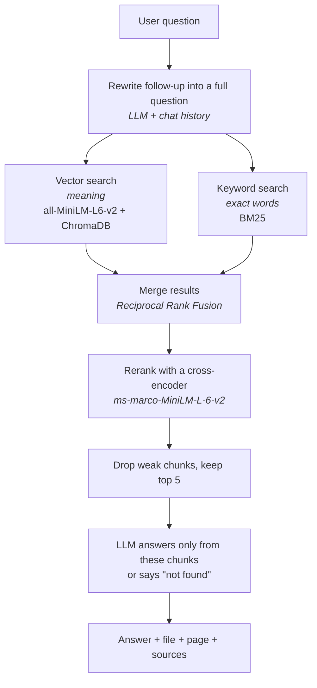

<h1 align="center">📄 AI Document Assistant</h1>

<p align="center">
  <b>Chat with your PDFs. Every answer shows the page it came from, and the app says "not found" instead of making things up.</b>
</p>

<p align="center">
  
  
  
  
  
  
</p>

<p align="center">
  <a href="#demo">Demo</a> •
  <a href="#results">Results</a> •
  <a href="#how-it-works">How it works</a> •
  <a href="#evaluation">Evaluation</a> •
  <a href="#setup">Setup</a>
</p>

---

<a id="demo"></a>

## 🎬 Demo

<!-- Edit this file on GitHub and drag your .mp4 here. Delete this line and the next one after. -->
VIDEO_LINK_HERE


In the video: upload a 28-page manual → ask a question and see the page and sources → ask about an error code →
ask a follow-up ("How do I fix it?") → ask something not in the PDF and get "not found".

---

<a id="results"></a>

## 📊 Results at a glance

Tested with **68 questions** on two documents, including **10 questions that have no answer** in the PDF.

| | 6-page handbook | 28-page manual |
|---|:---:|:---:|
| **Full app correct** (search + AI) | **35/35 (100%)** | **32/33 (97%)** |
| No-answer questions → "not found" | 5/5 | 5/5 |
| Right page ranked first: vector search only | 97% | 71% |
| Right page ranked first: **with reranker** | **100%** | **86%** |

**The key finding:** a relevance score alone can't decide whether a document contains the answer. One question with no answer
scored *higher* than real questions. So the app uses a low score cutoff and lets the LLM make the final "not found" call.
It got all 10 no-answer questions right. [Details below.](#what-i-learned)

---

## ✨ Features

| | |
|---|---|
| 📚 **Many PDFs** | Upload several files. Re-uploading the same file does not create copies. |
| 🎯 **Search all or one** | Pick a single document in the "Search in" dropdown, or search everything. |
| 🔎 **Answers with sources** | Every answer shows the file and page, plus the exact text used. |
| 💬 **Follow-up questions** | "How do I fix it?" is rewritten using the chat history before searching. |
| 🚫 **Says "not found"** | No made-up answers when the documents don't contain it. |
| ⚡ **Streaming** | Answers appear word by word. |
| 🛡️ **Clear errors** | Scanned or image-only PDFs get a clear message instead of a crash. |

---

<a id="how-it-works"></a>

## ⚙️ How it works



### Key design decisions

- **Two searches instead of one.** Vector search finds text with the same *meaning*, even with different words.
  Keyword search finds *exact* terms like error codes (`E215`) and part numbers. The results are merged with Reciprocal Rank Fusion.
- **A reranker on top.** The first searches are fast but rough. A cross-encoder reads the question and each chunk *together*,
  so it ranks them much more accurately. This was the biggest gain in testing (71% → 86%).
- **A low cutoff, with the LLM deciding "not found".** Testing showed that scores can't separate answerable from unanswerable
  questions, so the cutoff only removes clearly unrelated text.
- **Stable chunk IDs.** IDs are built from the file's SHA-256 hash, so uploading the same file twice replaces it instead of making copies.
- **Measured, not guessed.** Every choice above was compared with an evaluation script (see [Evaluation](#evaluation)).

---

## 🧰 Tech stack

| Part | Tool |
|---|---|
| UI | Streamlit |
| PDF loading and chunking | LangChain (`PyPDFLoader`, `RecursiveCharacterTextSplitter`) |
| Embeddings | `all-MiniLM-L6-v2` (sentence-transformers) |
| Vector database | ChromaDB (saved on disk) |
| Keyword search | BM25 (`rank_bm25`) |
| Reranker | `cross-encoder/ms-marco-MiniLM-L-6-v2` |
| LLM | OpenAI, via `langchain-openai` |
| Testing | pytest + custom evaluation script |

---

<a id="setup"></a>

## 🚀 Setup

**1. Clone and install**

```bash
git clone https://github.com/HasanveerKaur0987/ai-document-assistant.git
cd ai-document-assistant
python -m venv .venv
source .venv/bin/activate        # Windows: .venv\Scripts\activate
pip install -r requirements.txt
```

**2. Add your OpenAI key.** Create a file named `.env` in the project folder:

```
OPENAI_API_KEY=your-key-here
```

**3. Run the app**

```bash
cd src
streamlit run app.py
```

The embedding model and reranker download automatically the first time (about 100 MB).

<details>
<summary><b>Settings</b> (<code>src/config.py</code>)</summary>

| Setting | Value | Meaning |
|---|---|---|
| `CHUNK_SIZE` | 800 | Characters per chunk |
| `CHUNK_OVERLAP` | 100 | Characters shared between chunks |
| `FETCH_K` | 25 | Chunks fetched before reranking |
| `TOP_K` | 5 | Chunks sent to the LLM |
| `RERANK_THRESHOLD` | -7.0 | Chunks scoring below this are dropped |

</details>

<details>
<summary><b>Project structure</b></summary>

```
ai-document-assistant/
├── data/
│   ├── documents/
│   │   ├── zentora_handbook.pdf  # small test PDF (6 pages)
│   │   └── homecell_manual.pdf   # bigger test PDF (28 pages)
│   └── vector_store/             # ChromaDB files (created automatically)
├── tests/
│   ├── conftest.py               # shared test setup
│   └── test_rag.py               # pytest tests
├── requirements.txt
└── src/
    ├── .streamlit/               # Streamlit settings
    ├── app.py                    # Streamlit app
    ├── main.py                   # add / delete documents, ask questions
    ├── pdf_processor.py          # load PDF and split into chunks
    ├── embeddings.py             # create embeddings
    ├── vector_store.py           # ChromaDB wrapper
    ├── retriever.py              # hybrid search + rerank
    ├── llm.py                    # question rewrite, prompt, answers
    ├── config.py                 # all settings in one place
    ├── logger.py                 # logging setup
    ├── evaluate.py               # evaluation script
    ├── eval_questions.json       # 35 questions for the Zentora handbook
    └── eval_questions_big.json   # 33 questions for the HomeCell manual
```

</details>

---

## 🧪 Tests

Unit tests check the parts that are easy to break: no copies on re-upload, deleting one file only, empty database,
keyword tokenizing of codes, merging search results, and chunk size limits. They don't call OpenAI and run in seconds.

```bash
pytest
```

---

<a id="evaluation"></a>

## 📈 Evaluation

### Test documents

Both documents are made up for testing and are included in `data/documents/`.

| Document | Pages | Chunks | Questions with an answer | Questions with no answer |
|---|:---:|:---:|:---:|:---:|
| `zentora_handbook.pdf`: company handbook | 6 | 7 | 30 | 5 |
| `homecell_manual.pdf`: home battery manual | 28 | 45 | 28 | 5 |

The HomeCell manual is the harder test. It has many exact codes, topics that sound alike, and questions that use
**different words** than the PDF (for example "blackout" when the PDF says "outage", or "guarantee" for "warranty").

### How to run

Upload the PDFs in the app first, then:

```bash
cd src
python evaluate.py zentora_handbook.pdf                                            # search tests (free, seconds)
python evaluate.py homecell_manual.pdf --questions eval_questions_big.json
python evaluate.py homecell_manual.pdf --questions eval_questions_big.json --llm   # also test the AI answers
```

The search tests compare three setups and look at only **5 chunks** per question, so the differences are clear.
The full app test (`--llm`) uses the real app settings.

### Results: search

| Metric | Meaning |
|---|---|
| Right page first | The correct page was the top result |
| Right page in top 5 | The correct page was somewhere in the top 5 |
| MRR | Average of 1 ÷ (position of the correct page). 1.0 is perfect |
| No-answer blocked | Search returned nothing, so the LLM was not called |

**HomeCell manual (28 pages)**

| Setup | Right page first | Right page in top 5 | MRR | No-answer blocked |
|---|:---:|:---:|:---:|:---:|
| 1. Vector only | 20/28 (71%) | 28/28 (100%) | 0.84 | (no cutoff) |
| 2. Vector + reranker | **24/28 (86%)** | 27/28 (96%) | **0.90** | 1/5 |
| 3. Hybrid + reranker (final) | **24/28 (86%)** | 26/28 (93%) | 0.88 | 1/5 |

**Zentora handbook (6 pages)**

| Setup | Right page first | Right page in top 5 | MRR | No-answer blocked |
|---|:---:|:---:|:---:|:---:|
| 1. Vector only | 29/30 (97%) | 30/30 (100%) | 0.98 | (no cutoff) |
| 2. Vector + reranker | 30/30 (100%) | 30/30 (100%) | 1.00 | 3/5 |
| 3. Hybrid + reranker (final) | 30/30 (100%) | 30/30 (100%) | 1.00 | 3/5 |

### Results: full app (search + AI)

| Document | Answer questions answered | No-answer questions got "not found" | Total |
|---|:---:|:---:|:---:|
| Zentora handbook | 30/30 | 5/5 | **35/35 (100%)** |
| HomeCell manual | 27/28 | 5/5 | **32/33 (97%)** |

The one miss: "What happens to my house when there is a blackout?" The PDF uses the word "outage", and every chunk
scored below the cutoff, so the app said "not found".

### What I learned

**1. A small document hides the differences.** On the 6-page handbook every setup scored almost 100%.
I built a 28-page manual to see what each part really does.

**2. The reranker is the most useful part.** It raised "right page first" from 71% to 86% on the manual.

**3. Hybrid search did not help on these documents.** I expected keyword search to help with codes like `E142`,
but vector search already found them. On one question it made things worse: "How heavy is the battery?"
The PDF says "Weight: 98 kg", never "heavy", so keyword search only matched "battery", which is on almost every page.
Those pages pushed the right one out of the top 5.

**4. A score cutoff can't decide "not found" on its own.**

| Question | Has an answer? | Rerank score |
|---|:---:|:---:|
| Zentora: What uptime does the SLA guarantee? | Yes | -5.57 |
| Zentora: Can customers get a refund? | Yes | -0.69 |
| Zentora: What is Zentora's stock ticker symbol? | **No** | **-0.56** |
| HomeCell: How long is the guarantee? | Yes | -4.84 |
| HomeCell: Who is the CEO of Solvane Energy? | **No** | **+3.00** |

No single number can split these. So the cutoff is kept low (-7.0), and the LLM makes the final "not found"
decision. It got all 10 no-answer questions right. Even at -7.0 the cutoff blocked one real question (the "blackout" one),
which shows the risk of setting it higher.

### Limits of this test

- **Both documents are made up** and fairly clean. Real PDFs with tables, columns or scanned pages may score lower.
- **The cutoff was chosen while looking at these questions,** so scores may be a bit better than on new questions.
- **The full app test checks** whether the AI answered or said "not found", not whether each answer is exactly right.

---

## 🔭 Next steps

- [ ] Remove very common words (like "the", "is", "battery") before keyword search
- [ ] Lower or remove the reranker cutoff, since the LLM already handles "not found" well
- [ ] Check answer content automatically (expected answers in the test file)
- [ ] Support scanned PDFs with OCR
- [ ] Show the source page as an image next to the answer