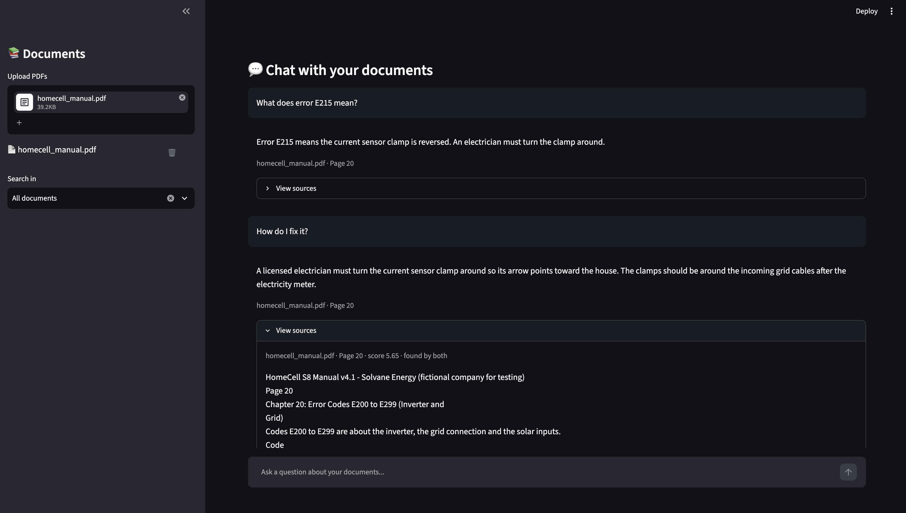

# AI Document Assistant

Chat with your PDFs. Upload one or more PDFs, ask questions in plain English, and get answers that show the file and page they came from.

If the answer is not in your documents, the app says so instead of making something up.

## Demo

<!-- Edit this file on GitHub and drag your .mp4 here. Delete this line and the next one after. -->
VIDEO_LINK_HERE

In the video:

1. Upload a 28-page product manual
2. Ask a normal question: answer with file, page and sources
3. Ask about an error code (`E215`)
4. Ask a follow-up question ("How do I fix it?")
5. Ask something not in the PDF: the app says it could not find the answer



**Results:** 97% correct on a 28-page manual and 100% on a 6-page handbook (search + AI). See [Evaluation](#evaluation).

---

## Features

- **Upload many PDFs.** Re-uploading the same file does not create copies.
- **Search all documents or just one,** using the "Search in" dropdown.
- **Answers with sources.** Each answer shows the file and page, plus a "View sources" panel with the exact text used.
- **Follow-up questions.** Questions like "What about the Pro plan?" are rewritten using the chat history before searching.
- **Says "not found"** when the documents don't contain the answer.
- **Streaming answers.** Text appears as it is written.
- **Delete documents** from the sidebar.
- **Clear errors** for scanned or image-only PDFs with no readable text.

---

## How it works

```
Question
   │
   ▼
Rewrite follow-up into a full question  (LLM, uses chat history)
   │
   ├──► Vector search   (meaning)       ─┐
   │    all-MiniLM-L6-v2 + ChromaDB      │
   │                                     ├──► Merge (Reciprocal Rank Fusion)
   └──► Keyword search  (exact words)   ─┘            │
        BM25                                          ▼
                                       Rerank with a cross-encoder
                                       (ms-marco-MiniLM-L-6-v2)
                                                      │
                                                      ▼
                                       Drop weak chunks, keep top 5
                                                      │
                                                      ▼
                                       LLM answers using only these chunks
                                       (or says "not found")
```

**Why two searches?** Vector search finds text with the same meaning, even with different words. Keyword search finds exact terms like error codes (`ERR-4031`) or plan names. Using both catches more.

**Why a reranker?** The first searches are fast but rough. The cross-encoder reads the question and each chunk together, so it ranks them much more accurately.

---

## Tech stack

| Part | Tool |
|---|---|
| UI | Streamlit |
| PDF loading and chunking | LangChain (`PyPDFLoader`, `RecursiveCharacterTextSplitter`) |
| Embeddings | `all-MiniLM-L6-v2` (sentence-transformers) |
| Vector database | ChromaDB (saved on disk) |
| Keyword search | BM25 (`rank_bm25`) |
| Reranker | `cross-encoder/ms-marco-MiniLM-L-6-v2` |
| LLM | OpenAI, via `langchain-openai` |

---

## Project structure

```
ai-document-assistant/
├── data/
│   ├── documents/
│   │   ├── zentora_handbook.pdf  # small test PDF (6 pages)
│   │   └── homecell_manual.pdf   # bigger test PDF (28 pages)
│   └── vector_store/             # ChromaDB files (created automatically)
├── tests/
│   ├── conftest.py               # shared test setup
│   └── test_rag.py               # pytest tests
├── requirements.txt
└── src/
    ├── .streamlit/               # Streamlit settings
    ├── app.py                    # Streamlit app
    ├── main.py                   # add / delete documents, ask questions
    ├── pdf_processor.py          # load PDF and split into chunks
    ├── embeddings.py             # create embeddings
    ├── vector_store.py           # ChromaDB wrapper
    ├── retriever.py              # hybrid search + rerank
    ├── llm.py                    # question rewrite, prompt, answers
    ├── config.py                 # all settings in one place
    ├── logger.py                 # logging setup
    ├── evaluate.py               # evaluation script
    ├── eval_questions.json       # 35 questions for the Zentora handbook
    └── eval_questions_big.json   # 33 questions for the HomeCell manual
```

---

## Setup

**1. Clone and install**

```bash
git clone <your-repo-url>
cd <your-repo-folder>
python -m venv .venv
source .venv/bin/activate        # Windows: .venv\Scripts\activate
pip install -r requirements.txt
```

**2. Add your OpenAI key**

Create a file named `.env` in the project folder:

```
OPENAI_API_KEY=your-key-here
```

**3. Run the app**

```bash
cd src
streamlit run app.py
```

The embedding model and reranker download automatically the first time (about 100 MB).

---

## Settings

All settings are in `src/config.py`:

| Setting | Value | Meaning |
|---|---|---|
| `CHUNK_SIZE` | 800 | Characters per chunk |
| `CHUNK_OVERLAP` | 100 | Characters shared between chunks |
| `FETCH_K` | 25 | Chunks fetched before reranking |
| `TOP_K` | 5 | Chunks sent to the LLM |
| `RERANK_THRESHOLD` | -7.0 | Chunks scoring below this are dropped |

---

## Tests

Run the unit tests from the project folder:

```bash
pytest
```

---

## Evaluation

I tested the app on two made-up documents, each with its own question file:

| Document | Pages | Chunks | Questions with an answer | Questions with no answer |
|---|---|---|---|---|
| `zentora_handbook.pdf`: company handbook | 6 | 7 | 30 | 5 |
| `homecell_manual.pdf`: home battery manual | 28 | 45 | 28 | 5 |

The HomeCell manual is the harder test. It has many exact codes (error codes like `E142`, part numbers like `HC-WB2`),
topics that sound alike, and questions that use **different words** than the PDF (for example "blackout" when the PDF says "outage").

Both PDFs are in `data/documents/`.

### How to run

Upload the PDFs in the app first, then:

```bash
cd src
python evaluate.py zentora_handbook.pdf                                        # search tests (free, a few seconds)
python evaluate.py homecell_manual.pdf --questions eval_questions_big.json
python evaluate.py homecell_manual.pdf --questions eval_questions_big.json --llm   # also test the AI answers
```

The search tests look at only **5 chunks** per question, so the three setups show clear differences.
The full app test (`--llm`) uses the real app settings (25 chunks, then rerank).

### What the numbers mean

| Metric | Meaning |
|---|---|
| Right page first | The correct page was the top result |
| Right page in top 5 | The correct page was somewhere in the top 5 results |
| MRR | Average of 1 ÷ (position of the correct page). 1.0 is perfect |
| No-answer blocked | For no-answer questions, search returned nothing, so the LLM was not called |

### Results: search

**Zentora handbook (6 pages)**

| Setup | Right page first | Right page in top 5 | MRR | No-answer blocked |
|---|---|---|---|---|
| 1. Vector only | 29/30 (97%) | 30/30 (100%) | 0.98 | (no cutoff) |
| 2. Vector + reranker | 30/30 (100%) | 30/30 (100%) | 1.00 | 3/5 |
| 3. Hybrid + reranker (final) | 30/30 (100%) | 30/30 (100%) | 1.00 | 3/5 |

**HomeCell manual (28 pages)**

| Setup | Right page first | Right page in top 5 | MRR | No-answer blocked |
|---|---|---|---|---|
| 1. Vector only | 20/28 (71%) | 28/28 (100%) | 0.84 | (no cutoff) |
| 2. Vector + reranker | 24/28 (86%) | 27/28 (96%) | 0.90 | 1/5 |
| 3. Hybrid + reranker (final) | 24/28 (86%) | 26/28 (93%) | 0.88 | 1/5 |

### Results: full app (search + AI)

| Document | Answer questions answered | No-answer questions got "not found" | Total |
|---|---|---|---|
| Zentora handbook | 30/30 | 5/5 | **35/35 (100%)** |
| HomeCell manual | 27/28 | 5/5 | **32/33 (97%)** |

The one miss: "What happens to my house when there is a blackout?" The PDF uses the word "outage", and every chunk scored
below the reranker cutoff, so the app said "not found".

### What I learned

**1. A small document hides the differences.** On the 6-page handbook every setup scored almost 100%.
The 28-page manual was needed to see what each part really does.

**2. The reranker is the most useful part.** On the manual, it raised "right page first" from 71% to 86%.

**3. Hybrid search did not help on these documents.** I expected keyword search to help with exact codes like `E142`,
but vector search already found them. On one question it made results worse: "How heavy is the battery?"
The PDF says "Weight: 98 kg", never "heavy", so keyword search only matched "battery", which is on almost every page.
Those pages pushed the right one out of the top 5. Removing very common words before keyword search could fix this.

**4. A score cutoff cannot decide "not found" on its own.** Real questions and no-answer questions get similar scores:

| Question | Has an answer? | Rerank score |
|---|---|---|
| Zentora: What uptime does the SLA guarantee? | Yes | -5.57 |
| Zentora: Can customers get a refund? | Yes | -0.69 |
| Zentora: What is Zentora's stock ticker symbol? | **No** | **-0.56** |
| HomeCell: How long is the guarantee? | Yes | -4.84 |
| HomeCell: Who is the CEO of Solvane Energy? | **No** | **3.00** |

No single number can split them. So the cutoff is kept low (-7.0) and only drops clearly unrelated text.
The LLM makes the final "not found" decision, and it got all 10 no-answer questions right.
Even at -7.0, the cutoff still blocked one real question (the "blackout" one), which shows the risk of setting it higher.

### Limits of this test

- **Both documents are made up** and fairly clean. Real PDFs with tables, columns or scanned pages may score lower.
- **The cutoff was chosen while looking at these questions,** so the scores may be a bit better than on new questions.
- **The full app test only checks** whether the AI gave an answer or said "not found". It does not check that each answer is exactly right.

---

## Possible improvements

- Remove very common words (like "the", "is", "battery") before keyword search
- Lower or remove the reranker cutoff, since the LLM already handles "not found" well
- Check answer content automatically (expected answers in the test file)
- Support scanned PDFs with OCR
- Show the source page as an image next to the answer